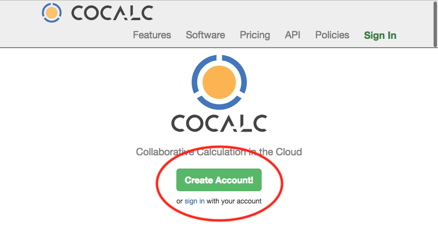
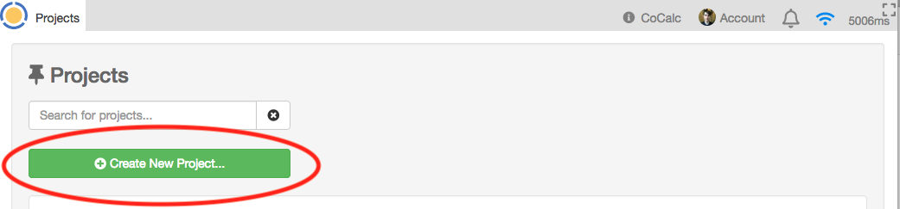
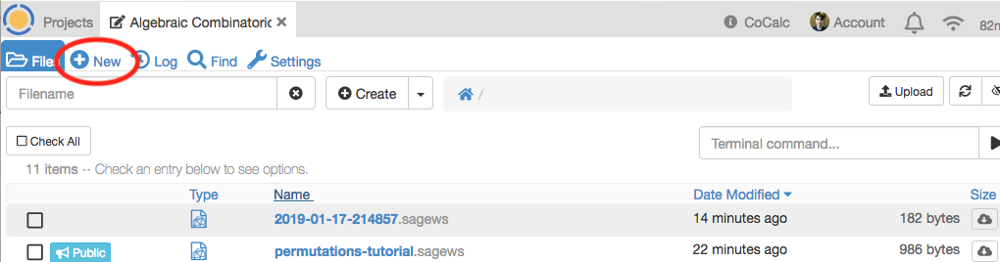
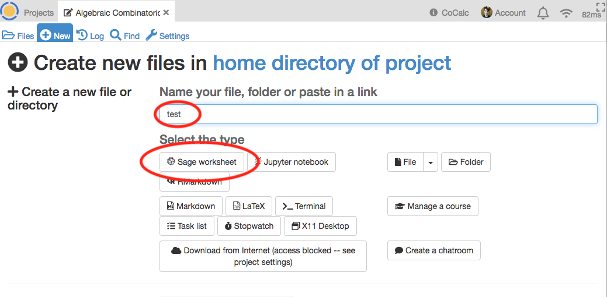
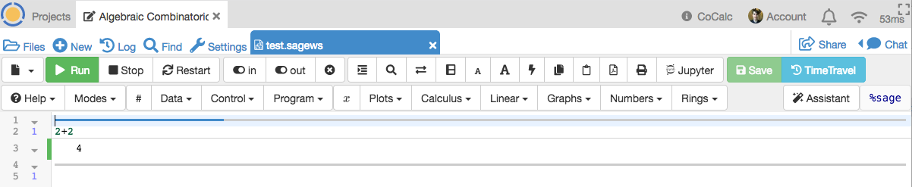

SageMath Permutation Tutorial
====

[SageMath](https://www.sagemath.org/) is a free and open source computer algebra system. For this tutorial, we will use a website called [CoCalc](https://cocalc.com/) which allows you to use SageMath from your web browser.

Using CoCalc
----

1. Go to [https://cocalc.com/](https://cocalc.com/) and sign up for an account.
    

        
 Image 

    
        
    

1. Once you log in, you will be presented with your "Projects" page. Click "Create New Project" and call it "Algebraic Combinatoric Class" or something else descriptive for yourself.

1. A project is a collection of documents and worksheets. Create a new worksheet by clicking the blue (+) icon on the top left. 
    
    - Name it "test"
    - Select "Sage worksheet" for the type
    
1. Now it should open the worksheet automatically with a single cell. Type "2+2" and then hit "Shift+Enter". It should output "4". 
    
1. You are now ready to go through the tutorial worksheet [here](https://cocalc.com/share/495b25fe-5784-4f66-94ea-ecb0da67fa42/permutations-tutorial.sagews?viewer=share)
    - Copy the worksheet into your CoCalc project by hitting "Open in Cocalc" on the top right.
    - Follow the instructions to practice doing combinatorics with SageMath!
