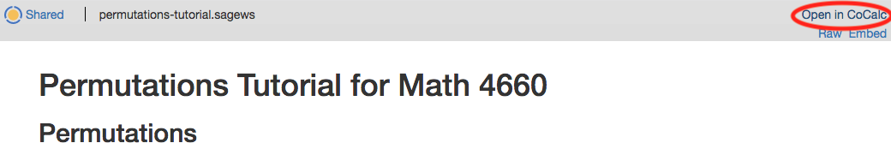
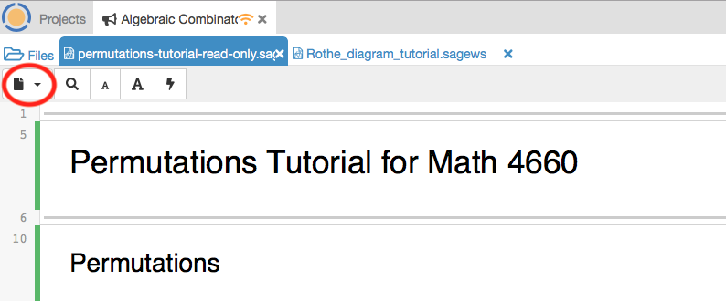
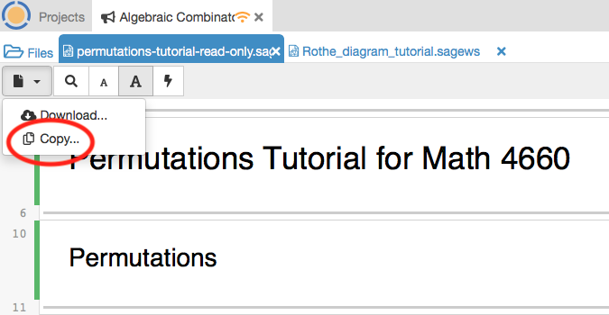

SageMath Permutation Tutorial
====

[SageMath](https://www.sagemath.org/) is a free and open source computer algebra system built on top of the [Python programming language](https://www.python.org/). For this tutorial, we will use a website called [CoCalc](https://cocalc.com/) which allows you to use SageMath from your web browser.

Using CoCalc
----

1. Go to [https://cocalc.com/](https://cocalc.com/) and sign up for an account.
    

        
 Image 

        
    

1. Once you log in, you will be presented with your "Projects" page. Click "Create New Project" and call it "Algebraic Combinatoric Class" or something else descriptive for yourself.
    

        
 Image 

        
    

1. A project is a collection of documents and worksheets. Create a new worksheet by clicking the blue (+) icon on the top left. 
    

        
 Image 

        
    

    
    - Name it "test"
    - Select "Sage worksheet" for the type
    
    

        
 Image 

        
    

1. Now it should open the worksheet automatically with a single cell. Type "2+2" and then hit "Shift+Enter". It should output "4".
    

        
 Image 

        
    

1. You are now ready to go through the Permutation Tutorial worksheet [here](https://cocalc.com/share/495b25fe-5784-4f66-94ea-ecb0da67fa42/permutations-tutorial-read-only.sagews?viewer=share)
    - Copy the worksheet into your CoCalc project by hitting "Open in Cocalc" on the top right.
    
    

        
 Image 

        
    

    
    - Then, click on the little "Page" button below the "Files" button on the top left and select "Copy..."
    
    

        
 Image 

        
    

    
    

        
 Image 2

        
    

    
    - In the "Copy" pane, set "In the project" to "Algebraic Combinatorics Class" or whatever you named your project. Leave the "Destination" field empty.
    - Now, click "Projects" in the top left corner and navigate to your "Algebraic Combinatorics Class" project. The permutations-tutorial.sagews should now be in your files list. Open it!
    - Follow the instructions to practice doing combinatorics with SageMath!

Other Tutorials
---
If you find that you have extra time, you can look at any of these resources/tutorials that you find interesting.

1. [How to use Sage to generate LaTeX code](https://cocalc.com/share/495b25fe-5784-4f66-94ea-ecb0da67fa42/Using-Sage-to-make_LaTeX.sagews?viewer=share)
1. Any [Thematic Tutorial](https://doc.sagemath.org/html/en/thematic_tutorials/index.html) of SageMath you might find interesting!
